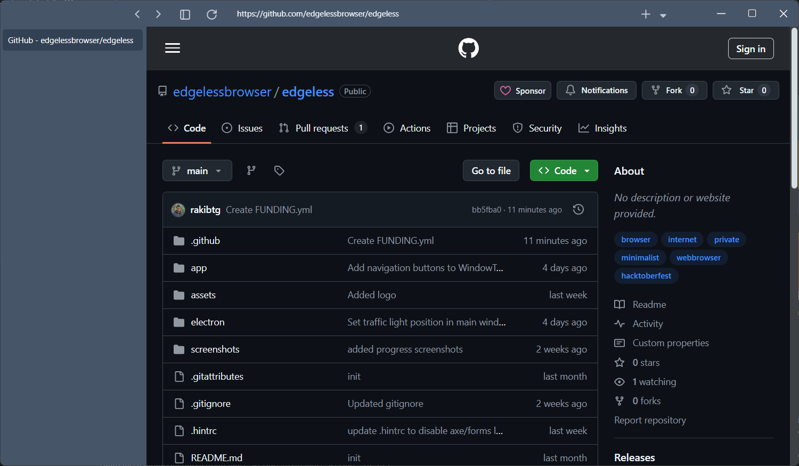

# Edgeless Browser


Edgeless Browser is a browser that is built on top of the electron framework and uses the solidjs library for the front end. The browser is a work in progress and is not yet ready for use. The browser is being built to be a more privacy focused browser that is secure and minimalistic. The browser is being built by Hasan and is open source so feel free to contribute to the project.



### getting started

to get started install the dependencies in both the app and electron directories

```bash
git clone https://github.com/edgelessbrowser/edgeless

# cd
cd edgeless

# installing app (solidjs) dependecies
cd app
yarn install

# Run the app in development mode
yarn dev
```

> More information is coming soon.

Tweet at [@rakibtg](https://twitter.com/rakibtg)
