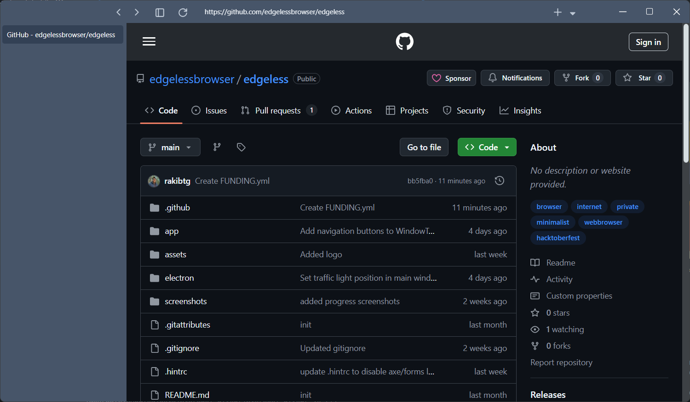

# Eon Browser


Eon Browser is a minimal and privacy-focused web browser built on top of the Electron framework and SolidJS. The browser is a work in progress and is not yet ready for production use. It is an open-source project, and contributions are welcome.



### Getting Started

To get started with Eon Browser, follow these steps:

1.  **Clone the repository:**

    ```bash
    git clone https://github.com/edgelessbrowser/edgeless.git
    ```

2.  **Navigate to the project directory:**

    ```bash
    cd edgeless
    ```

3.  **Install the dependencies:**

    ```bash
    npm install
    ```

4.  **Run the app in development mode:**

    ```bash
    npm run dev
    ```

### Building for Production

To build the application for production, use the following commands:

-   **Build for Windows:**
    ```bash
    npm run build:win
    ```
-   **Build for macOS:**
    ```bash
    npm run build:mac
    ```
-   **Build for Linux:**
    ```bash
    npm run build:linux
    ```

> More information is coming soon.

---

Tweet at [@rakibtg](https://twitter.com/rakibtg)
